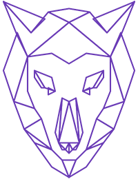

<h1 align="center">
    
</h1>

<h2 align="center">
  ⭐ Curso de CSS Avançado Posicionamento - Origamid
</h2>

  <a href="#two_hearts-o-projeto">O Projeto</a>&nbsp;&nbsp;&nbsp;|&nbsp;&nbsp;&nbsp;
  <a href="#rocket-tecnologias">Tecnologias</a>&nbsp;&nbsp;&nbsp;|&nbsp;&nbsp;&nbsp;
  <a href="#rocket-site-online">Projeto Online</a>&nbsp;&nbsp;&nbsp;|&nbsp;&nbsp;&nbsp;&nbsp;
  <a href="#computer-layout">Layout</a>&nbsp;&nbsp;&nbsp;|&nbsp;&nbsp;&nbsp;

 

# :two_hearts: O Projeto

O **Brafé** foi criado durante o curso de CSS avançado da Origamid. Recriaremos este layout utilizando CSS Puro, Grid, Flexbox e Bootstrap.

Todo o site é responsivo e adaptável para desktop, tablet e smartphone.

# :rocket: Tecnologias

O Brafé foi desenvolvido com as seguintes tecnologias:

- HTML 5
- CSS 3
  - Puro
  - Grids
  - Flexbox
- Bootstrap

# :rocket: Projeto Online

Veja o Brafé em funcionamento acesse o link abaixo:

https://pgratao.com.br/brafe1

# :computer: Layout

## Site Desktop

## Site Tablet

## Site Mobile

---

Feito com ❤️ por **Patryck Gratão no Curso CSS Avançado da Origamid**